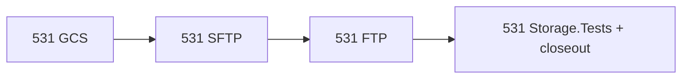

# Complete #531 — Additional Storage Providers

**GitHub:** [#531](https://github.com/AvantiPoint/avantipoint.packages/issues/531)

## Current state

| Item | Status |
|------|--------|
| Azure Blob | Done (`AvantiPoint.Packages.Azure`) |
| AWS S3 | Done (`AvantiPoint.Packages.Aws`) |
| FileSystem | Done (`AvantiPoint.Packages.Core`) |
| **S3-compatible** (MinIO, R2, Wasabi, **Alibaba OSS**, etc.) | **Done** — `ServiceUrl`, `ForcePathStyle`, [s3-compatible.md](docs/docs/storage/s3-compatible.md) |
| Google Cloud Storage | **Not started** |
| SFTP | **Not started** |
| FTP/FTPS | **Not started** |
| Dedicated Alibaba package | **Out of scope** — use S3-compatible config only |

---

## Shared conventions (all new providers)

Mirror [`AvantiPoint.Packages.Aws`](src/AvantiPoint.Packages.Aws/AwsApplicationExtensions.cs) and [`AvantiPoint.Packages.Azure`](src/AvantiPoint.Packages.Azure/AzureApplicationExtensions.cs):

| Piece | Location |
|-------|----------|
| `IStorageService` | `Storage/{Name}StorageService.cs` |
| Options + validation | `Configuration/{Name}StorageOptions.cs` (`IValidatableObject`) |
| Discovery | `Storage/{Name}StorageServiceProvider.cs` (`IStorageServiceProvider`) |
| DI | `{Name}ApplicationExtensions.cs`: `Add*Storage`, `Add*Storage(Action<>)`, `AutoDiscover*Storage` |
| Provider name | [`StorageProviderNames`](src/AvantiPoint.Packages.Core/Discovery/StorageProviderNames.cs) |

**Register in:** [`APPackages.slnx`](APPackages.slnx), [`Directory.Packages.props`](Directory.Packages.props), [`IntegrationTestApi/Program.cs`](samples/IntegrationTestApi/Program.cs), samples via `AutoDiscover*`.

### `GetDownloadUriAsync`

| Provider | Strategy |
|----------|----------|
| **GCS** | V4 signed URL (like S3 presign / Azure SAS) |
| **FTP / SFTP** | Return `null` — downloads stream via [`GetAsync`](src/AvantiPoint.Packages.Hosting/Apis/PackageContent.cs); document no CDN redirects |

---

## A1. Google Cloud Storage — `AvantiPoint.Packages.Gcp`

**Separate from** [`AvantiPoint.Packages.Signing.Gcp`](src/AvantiPoint.Packages.Signing.Gcp) (signing only).

- Package: `Google.Cloud.Storage.V1`
- `GcsStorageService`: bucket + optional prefix (`packages/{id}/{version}/...`)
- Auth: `GOOGLE_APPLICATION_CREDENTIALS` / JSON key path (align with signing GCP options)
- **Emulator:** `EmulatorHost` / `StorageBaseUrl` for [fake-gcs-server](https://github.com/fsouza/fake-gcs-server) in tests — no GCP project in CI
- `ListFilesAsync` via bucket listing API
- Config: `Storage:Type` = `Gcs` or `GoogleCloudStorage`
- Docs: [`docs/docs/storage/gcs.md`](docs/docs/storage/gcs.md) + index link

---

## A2. SFTP — `AvantiPoint.Packages.Sftp`

- Package: `SSH.NET` (central pin in `Directory.Packages.props`)
- Options: `Host`, `Port`, `Username`, `Password` / `PrivateKeyPath`, `RemotePath`, timeouts, `MaxConnections` (simple pool)
- `SftpStorageService`: POSIX paths, create-new semantics like [`FileStorageService`](src/AvantiPoint.Packages.Core/Storage/FileStorageService.cs), retry transient SSH failures
- Config: `Storage:Type` = `Sftp`
- Docs: no atomic rename, proxy downloads, not for high concurrency

---

## A3. FTP/FTPS — `AvantiPoint.Packages.Ftp`

- Package: `FluentFTP`
- Options: `Host`, `Port`, `Username`, `Password`, `UseSsl`, `RemotePath`, passive mode, timeouts
- Same `IStorageService` surface as SFTP
- Config: `Storage:Type` = `Ftp`
- Docs: legacy / low-traffic only

---

## Testing (required)

**Principle:** Docker emulators only in CI. No Google Cloud projects, hosted FTP/SFTP, or storage secrets in GitHub Actions.

### Layers

| Layer | Scope | CI |
|-------|--------|-----|
| Unit | Options validation, path normalization, error mapping, test doubles | Always |
| Integration | Put → Get → List → Delete round-trip | `[DockerFact]` on `ubuntu-latest` |

### Recommended: `tests/AvantiPoint.Packages.Storage.Tests`

Shared fixtures (pattern: [`DockerFactAttribute`](tests/AvantiPoint.Packages.Integration.Tests/TestInfrastructure/DockerFactAttribute.cs), [`PostgreSqlTestcontainerFixture`](tests/AvantiPoint.Packages.Database.Tests/TestInfrastructure/PostgreSqlTestcontainerFixture.cs)):

| Provider | Testcontainers image | Config |
|----------|---------------------|--------|
| **S3-compatible (regression)** | `minio/minio` | `AwsS3`, `ServiceUrl`, `ForcePathStyle=true` |
| **GCS** | `fsouza/fake-gcs-server` | `Gcs` + emulator host |
| **SFTP** | `atmoz/sftp` | `Sftp`, container host/port/user |
| **FTP** | `stilliard/vsftpd` | `Ftp`, passive ports mapped |

Each fixture: canonical scenario (small `.nupkg` bytes → Get → List under `packages/` → Delete).

Docs: **Local testing** subsection per provider (Docker one-liner + Testcontainers), not production credential guides.

---

## Suggested order

1. GCS (largest parity with Azure/AWS)
2. SFTP
3. FTP
4. Integration test project + MinIO regression
5. Close #531

**Rough effort:** ~3–5 days.

---

## Close #531 when

- [ ] GCS + SFTP + FTP implemented and documented
- [ ] Unit tests per provider
- [ ] Docker emulator integration tests pass in CI (including MinIO S3-compat regression)
- [ ] Solution/samples wired
- [ ] #531 checklist updated on GitHub

## Out of scope (this plan)

- Issue #535 (mirror/search/origin)
- Dedicated `AvantiPoint.Packages.Aliyun` (use S3-compatible)
- Oracle OCI object storage (name collision with container registry OCI in multi-feed epic #557)

## Related

- [#535](https://github.com/AvantiPoint/avantipoint.packages/issues/535) — separate plan: [complete_535_mirror_search.plan.md](complete_535_mirror_search.plan.md)
- [#557](https://github.com/AvantiPoint/avantipoint.packages/issues/557) — multi-feed platform will consume `IStorageBackendFactory` later
