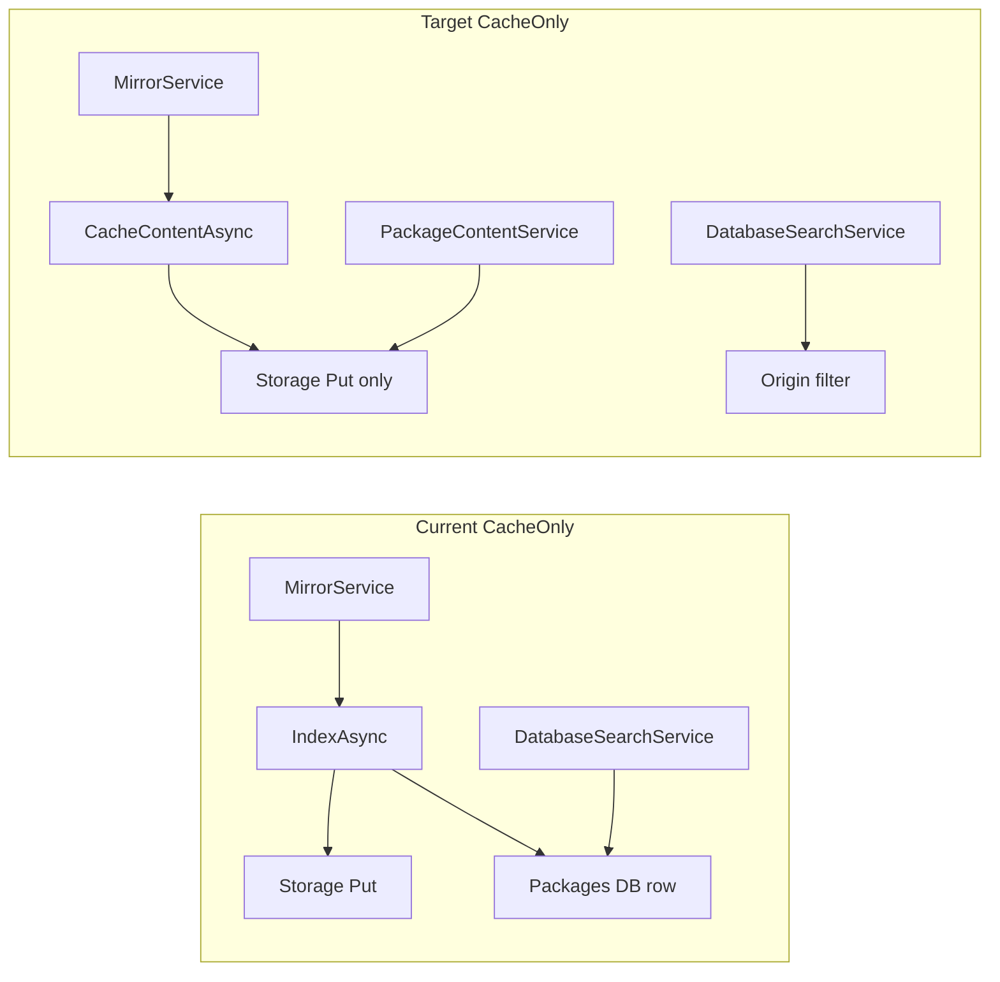
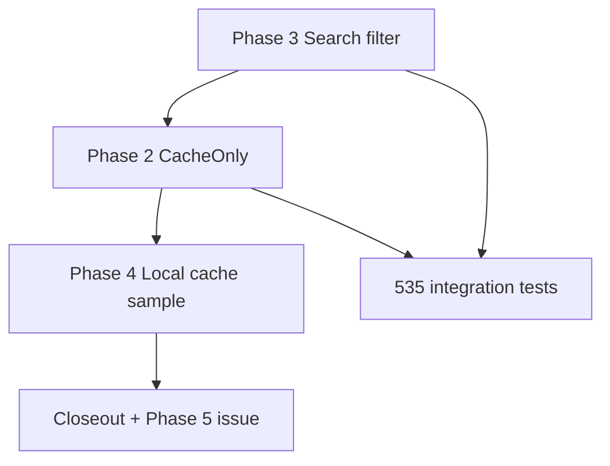

# Complete #535 — Package Origin, Mirror, and Search

**GitHub:** [#535](https://github.com/AvantiPoint/avantipoint.packages/issues/535)

## Current state

| Item | Status |
|------|--------|
| `PackageOrigin` enum + `Package.Origin` | Done |
| DB `Origin` column + default `Published` | Done |
| `PackageSourceCachingStrategy` | Done |
| Mirror sets `Origin` Mirrored/Cached | Partial ([`MirrorService`](src/AvantiPoint.Packages.Core/Mirror/MirrorService.cs)) |
| **Search filters by Origin** | **Not done** — [`DatabaseSearchService`](src/AvantiPoint.Packages.Core/Search/DatabaseSearchService.cs) ignores `Origin` |
| **True CacheOnly** (no DB row, restorable) | **Not done** — still `_packages.AddAsync` in [`PackageIndexingService`](src/AvantiPoint.Packages.Core/Indexing/PackageIndexingService.cs); restore needs DB via [`AddDownloadAsync`](src/AvantiPoint.Packages.Core/Content/DefaultPackageContentService.cs) |
| **Local cache / LightweightFeed Docker** | **Not started** |
| **Phase 5 federated search** | Out of scope → new issue at closeout |



---

## Phase 3 — Search and discovery filtering (do first)

**Why first:** Smallest risk; unblocks commercial-feed scenario (`IncludeMirroredPackages: false`).

### Configuration — extend [`SearchOptions`](src/AvantiPoint.Packages.Core/Configuration/SearchOptions.cs)

```json
"Search": {
  "Type": "Database",
  "IncludeMirroredPackages": false
}
```

- `IncludeMirroredPackages` default **`true`** (preserves current behavior)
- `false`: discovery = **`PackageOrigin.Published` only**
- `true`: **`Published` + `Mirrored`**; always exclude **`Cached`** from search, autocomplete, registration discovery

### Implementation

- `PackageOriginFilter` helper (Core): `ApplyDiscoveryFilter(IQueryable<Package>, SearchOptions)`
- Wire [`DatabaseSearchService`](src/AvantiPoint.Packages.Core/Search/DatabaseSearchService.cs): `SearchAsync`, `AutocompleteAsync`, `ListPackageVersionsAsync`, `SearchCountAsync`, `FindDependentsAsync` (decide: dependents published-only vs unchanged)
- Wire [`DefaultPackageMetadataService`](src/AvantiPoint.Packages.Core/Metadata/DefaultPackageMetadataService.cs) local merge + optional browse filter
- EF migration: **index on `Packages.Origin`** (SQL Server, SQLite, PostgreSQL, MySQL)

### Docs

- [`docs/docs/configuration.md`](docs/docs/configuration.md) — `Search` section
- [`docs/docs/mirrors.md`](docs/docs/mirrors.md) — commercial vs enterprise; fix “always indexed” text (~L235–251)
- New [`docs/docs/deployment-scenarios.md`](docs/docs/deployment-scenarios.md)

**Effort:** ~1–2 days

---

## Phase 2 — True `CacheOnly` semantics

**Goal:** Upstream packages on disk **without** `Packages` row; restore works; never in search.

1. **`PackageIngestionContext`** — add `SkipDatabasePersistence` when `CachingStrategy == CacheOnly` in [`MirrorService`](src/AvantiPoint.Packages.Core/Mirror/MirrorService.cs).

2. **`PackageIndexingService`** — when `SkipDatabasePersistence`: skip `_packages.AddAsync` and DB-dependent signing/index side effects; still write `.nupkg` + nuspec/readme/icon/license to storage.

3. **`DefaultPackageContentService`** — after `mirror.MirrorAsync`, if `AddDownloadAsync` fails (no row), `storage.GetPackageStreamAsync` when blob exists; handle signing branches without DB entity; `GetPackageVersionsOrNullAsync` union storage list + DB + upstream.

4. **Tests** — see Testing section below.

**Effort:** ~2–3 days

---

## Phase 4 — Lightweight Docker dev feed (local NuGet cache)

**Goal:** Minimal sample using developer `global-packages` with little extra disk.

1. **`ILocalPackageCacheService`** (Core) — path `{cacheRoot}/{id}/{version}/{id}.{version}.nupkg`; config `LocalCache:Path` (default `~/.nuget/packages`, `/nuget-cache` in container).

2. **Mirror/content integration** — `UseLocalCache` or `MirrorOptions.LocalCachePath`: check local cache before upstream in [`MirrorService`](src/AvantiPoint.Packages.Core/Mirror/MirrorService.cs) / [`DefaultPackageContentService`](src/AvantiPoint.Packages.Core/Content/DefaultPackageContentService.cs); optional copy to feed storage with `CacheOnly`.

3. **Sample** — `samples/LightweightFeed`: Sqlite in-memory/temp, `Search:IncludeMirroredPackages: false`, upstream `ProxyOnly` or `UseLocalCache`; `Dockerfile` (&lt;100MB) + `docker-compose.yml` mounting `~/.nuget/packages` read-only; README + deployment-scenarios link.

4. **Health** — `/health` in sample.

5. **devcontainer** — fix [`.devcontainer/devcontainer.json`](.devcontainer/devcontainer.json) missing compose reference (small follow-up).

**Out of scope here:** Phase 5 federated search, disk quota eviction, `PackageVersions` API for cache-only IDs.

**Effort:** ~2–3 days

---

## Testing (required)

**Principle:** Testcontainers for infrastructure; avoid live NuGet.org and cloud storage in CI.

| Area | Unit | Integration `[DockerFact]` |
|------|------|---------------------------|
| Search / origin | `PackageOriginFilter` on `IQueryable` | Testcontainers SQLite or PostgreSQL + FileSystem: publish → mirror `IndexAndCache` → search with `IncludeMirroredPackages: false` excludes mirrored |
| CacheOnly | Ingestion flags | Mirror `CacheOnly` → no `Packages` row → GET returns stream → search excludes |
| ProxyOnly | — | Storage unchanged after proxy (or [`NuGetTestServerHost`](tests/AvantiPoint.Packages.Protocol.Tests/Infrastructure/NuGetTestServerHost.cs)) |
| Local cache | Path resolution on temp dir shaped like `~/.nuget/packages` | CI uses temp fixture; LightweightFeed Docker is **manual/docs** validation |

LightweightFeed image **not required** in CI — integration tests prove behavior.

---

## Suggested order



1. Phase 3 — search filter  
2. Phase 2 — CacheOnly  
3. Phase 4 — LightweightFeed  
4. Integration tests + docs + closeout  

Can run **in parallel with #531** after Phase 3 starts (no file overlap).

**Rough effort:** Phases 2–4 ~4–6 days after Phase 3 (~1–2 days).

---

## Close #535 when

- [ ] `IncludeMirroredPackages` works across search, autocomplete, registration
- [ ] `CacheOnly` packages restorable without DB row; excluded from discovery
- [ ] LightweightFeed sample + Docker docs
- [ ] Integration tests pass on `ubuntu-latest`
- [ ] Docs updated
- [ ] New GitHub issue opened for **Phase 5** federated upstream search (link from #535)

## Out of scope (this plan)

- Issue #531 storage providers — [complete_531_storage_providers.plan.md](complete_531_storage_providers.plan.md)
- Phase 5 federated search (track as follow-up issue)
- Multi-feed platform (#557)

## Related

- [#531](https://github.com/AvantiPoint/avantipoint.packages/issues/531) — storage providers (parallel)
- [#557](https://github.com/AvantiPoint/avantipoint.packages/issues/557) — unified NuGet/OCI/npm host (future `IMirrorPolicyService` generalization)
