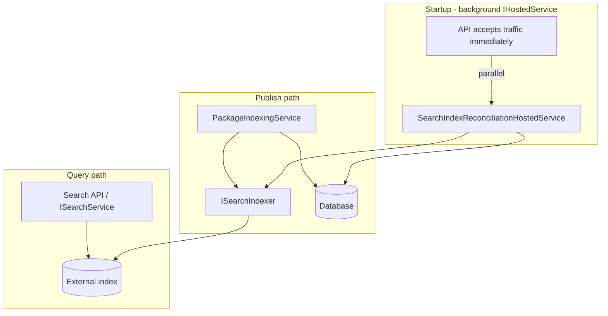
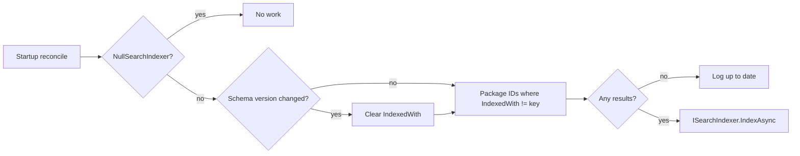

# External Search Providers (Azure, OpenSearch, Elasticsearch)

## Current state

- Search is implemented only via [`DatabaseSearchService`](src/AvantiPoint.Packages.Core/Search/DatabaseSearchService.cs) and [`NullSearchService`](src/AvantiPoint.Packages.Core/Search/NullSearchService.cs).
- [`ISearchIndexer`](src/AvantiPoint.Packages.Core/Search/ISearchIndexer.cs) is wired, but database search uses [`NullSearchIndexer`](src/AvantiPoint.Packages.Core/Search/NullSearchIndexer.cs) (no external index).
- Publish path already indexes: [`PackageIndexingService`](src/AvantiPoint.Packages.Core/Indexing/PackageIndexingService.cs) calls `_search.IndexAsync(package)` when `SkipSearchIndexing` is false (line ~237).
- Provider selection uses `Feed:Search:Type` via [`HasSearchType`](src/AvantiPoint.Packages.Core/Extensions/DependencyInjectionExtensions.Providers.cs) and `GetServiceFromProviders<ISearchService>()` (same pattern as storage).
- BaGetter reference in `temp/BaGetter` has a complete but **disabled** Azure Search path (`AddAzureSearch` throws `NotImplementedException`)—use as a porting guide, modernize to **`Azure.Search.Documents`** (not legacy `Microsoft.Azure.Search`).



---

## Step 0 — GitHub issues (do this first)

Create issues **before** implementation (via `gh issue create`), then reference them in the branch/PR:

| Issue | Title (suggested) |
|-------|-------------------|
| **Epic** | External search providers: Azure AI Search, OpenSearch, Elasticsearch |
| **#A** | Core: search document model, reconciliation, and provider registration |
| **#B** | Azure AI Search provider in `AvantiPoint.Packages.Azure` |
| **#C** | Elasticsearch provider (`AvantiPoint.Packages.Elasticsearch`) |
| **#D** | OpenSearch provider with AWS SigV4 in `AvantiPoint.Packages.Aws` |
| **#E** | Search indexing integration tests (Testcontainers) |
| **#F** | Documentation: search provider setup and migration from Database |

Link sub-issues to the epic; close via PR keywords (`Closes #...`).

---

## Step 1 — Core infrastructure ([`AvantiPoint.Packages.Core`](src/AvantiPoint.Packages.Core))

### 1.1 Configuration

Extend [`SearchOptions`](src/AvantiPoint.Packages.Core/Configuration/SearchOptions.cs):

- Keep `Type`: `Database` | `Null` | `AzureSearch` | `OpenSearch` | `Elasticsearch`
- Add tuning only (no opt-out for reconciliation):
  - `ReconcileBatchSize` (e.g. 100) — batch size for background reindex loops
- **Reconciliation policy (fixed, not configurable):**
  - **`NullSearchIndexer`** (`Key` = `"Null"` only): No reconciliation — applies to both `Database` and `Null` search types (same indexer class).
  - **External indexers:** Reconciliation **always** runs on startup in the background; only packages with `IndexedWith` null or `<> indexer.Key` are indexed.
  - API must **not** block waiting for reconcile to finish.
- Coordinate with pending [#535](.cursor/plans/complete_535_mirror_search.plan.md) work: external index documents must honor **`IncludeMirroredPackages`** / origin when that lands (index filter at write time).

Add validation in [`ValidateNuGetApiOptions`](src/AvantiPoint.Packages.Core/Validation/ValidateNuGetApiOptions.cs) or a dedicated `ValidateSearchOptions` for allowed `Search.Type` values.

### 1.2 Shared search document model (Core)

Introduce `PackageSearchDocument` (one document per **package ID**, all listed versions embedded—matches BaGetter `PackageDocument` shape and NuGet search response needs):

- Id, description, authors, tags, package types, frameworks, prerelease/semver flags, version arrays + per-version downloads, dependencies (for dependents), `Listed`, `Origin` (for mirror filtering).

Add **`IPackageSearchDocumentFactory`** (loads all versions for a package ID from `IPackageDatabase` / `IContext`) so all three providers share indexing logic.

### 1.3 `ISearchIndexer.Key` and `Package.IndexedWith`

#### Extend [`ISearchIndexer`](src/AvantiPoint.Packages.Core/Search/ISearchIndexer.cs)

```csharp
public interface ISearchIndexer
{
    /// <summary>Stable identifier for this indexer implementation type (e.g. "Null", "AzureSearch").</summary>
    string Key { get; }

    Task IndexAsync(Package package, CancellationToken cancellationToken);
    // optional: Task RemoveAsync(string packageId, ...);
}
```

Introduce **`SearchIndexerKeys`** constants in Core — **one key per indexer class**, not per `Search.Type`:

| Indexer class | `Key` | Notes |
|---------------|-------|--------|
| `NullSearchIndexer` | `"Null"` | **Single key** — used for both `Search.Type = Database` and `Search.Type = Null` |
| `AzureSearchIndexer` | `"AzureSearch"` | |
| `ElasticsearchSearchIndexer` | `"Elasticsearch"` | |
| `OpenSearchIndexer` (AWS) | `"OpenSearch"` | |

**Search.Type vs indexer key (important):**

| `Search.Type` | `ISearchService` | `ISearchIndexer` | Indexer `Key` |
|---------------|------------------|------------------|---------------|
| `Database` | `DatabaseSearchService` | `NullSearchIndexer` | `"Null"` |
| `Null` | `NullSearchService` | `NullSearchIndexer` | `"Null"` |
| `AzureSearch` | `AzureSearchService` | `AzureSearchIndexer` | `"AzureSearch"` |
| … | … | … | … |

`Search.Type` chooses **how queries run** (`ISearchService`). `ISearchIndexer.Key` identifies **which external index last wrote** `Package.IndexedWith`. Database and Null configs share the same no-op indexer and therefore the **same key** — they are not distinguished by `IndexedWith`.

**Database search pairing:** `AddDatabaseSearchSupport` registers **`DatabaseSearchService` + `NullSearchIndexer`** under `Search.Type = Database`. `Search.Type = Null` registers **`NullSearchService` + `NullSearchIndexer`**. Same indexer instance type and same `Key`; different search services.

#### Extend [`Package`](src/AvantiPoint.Packages.Core/Entities/Package.cs) entity

Add nullable string **`IndexedWith`** — stores the `ISearchIndexer.Key` that last successfully indexed this package **version** row.

- EF migration across SQL Server, SQLite, PostgreSQL, MySQL (same as other package columns).
- Index on `(Id, IndexedWith)` or filtered index for reconcile queries.
- On successful external index for a package ID: **update all `Package` rows** with that `Id` to `IndexedWith = indexer.Key`.
- On remove from external index: clear `IndexedWith` (null) for that package ID.
- `NullSearchIndexer.IndexAsync`: no external index write; may set `IndexedWith = SearchIndexerKeys.Null` on publish (optional). No external index exists for this key.

#### Reconciliation skip (no-op indexer)

`SearchIndexReconciliationHostedService` resolves the active **`ISearchIndexer`**:

1. **If the indexer is `NullSearchIndexer`** (preferred: `indexer is NullSearchIndexer`, equivalent to `indexer.Key == SearchIndexerKeys.Null`) → return immediately. Applies to **both** `Search.Type = Database` and `Search.Type = Null` because both use `NullSearchIndexer`.
2. Else the indexer is an **external** implementation → run background incremental reconcile.

Do **not** use `Search.Type` alone for this check; use the **indexer type/key** so the rule stays correct if configuration pairings change.

**Packages to index (filter):** Distinct package `Id` values where **any** listed version has:

`IndexedWith IS NULL OR IndexedWith <> @currentIndexerKey`

(respecting origin / `IncludeMirroredPackages` when available). Packages where **all** versions already have `IndexedWith == currentIndexerKey` are skipped.

Switching **external** provider (e.g. `Elasticsearch` → `AzureSearch`) changes `currentIndexerKey` → packages with old key are reindexed.

Switching **to** `Database` / `Null`: external reconcile stops (`NullSearchIndexer`); `IndexedWith` may still show `"Elasticsearch"` etc. until packages are republished — harmless because search reads from DB, not the old index. Switching **from** `Database` to `AzureSearch`: `IndexedWith` is `"Null"` or null for all packages → full external reindex.

#### Global metadata (optional, lightweight)

Keep a small **`SearchIndexState`** singleton row (not per-package): last reconcile run, global `SearchSchemaVersion`, in-progress flag.

When `SearchSchemaVersion` changes (document mapping bump): set `IndexedWith = NULL` on all packages (or treat null key as “needs reindex”) → one-time full reindex, then normal key-based skipping resumes.

#### Reconciliation algorithm (5.1) — key-based incremental

1. On startup, `SearchIndexReconciliationHostedService` runs; exit immediately when indexer is `NullSearchIndexer`.
2. Host starts immediately (no blocking).
3. If `SearchSchemaVersion` changed → clear `Package.IndexedWith` (bulk) or mark all for reindex; update global version.
4. Query package IDs needing work: `IndexedWith` null or `<> indexer.Key`.
5. For each ID, call `ISearchIndexer.IndexAsync`; on success, set `IndexedWith = indexer.Key` on all versions for that `Id`.
6. Remove orphaned external index documents for package IDs no longer in catalog; clear `IndexedWith`.
7. Log `Indexed`, `Skipped`, `Removed`; exit quickly if query returns zero IDs.
8. Never block host startup.



**Runtime behavior while reconciling:** Search API remains available; results may be incomplete until reconcile finishes. Publish-time indexing (5.2) sets `IndexedWith` so the next startup skips those package IDs.

**Publish path (5.2):** [`PackageIndexingService`](src/AvantiPoint.Packages.Core/Indexing/PackageIndexingService.cs) already calls `_search.IndexAsync(package)`; extend flow so indexer implementation (or shared `SearchIndexingCoordinator` in Core) updates `Package.IndexedWith` after success.

**Deletion/unlist:** Extend indexer contract or add `ISearchIndexer.RemoveAsync(packageId)` (recommended) so unlisted/deleted packages are removed from the external index.

### 1.4 Provider registration (Core)

- Add `AddExternalSearchSupport()` helpers mirroring [`AddDatabaseSearchSupport`](src/AvantiPoint.Packages.Core/Extensions/DependencyInjectionExtensions.Providers.cs).
- **`AddDatabaseSearchSupport`:** register `DatabaseSearchService` + `NullSearchIndexer` for `Search.Type = Database`.
- **`Null` search type:** `NullSearchService` + same `NullSearchIndexer` (same `Key = "Null"`).
- Fallback in [`AddFallbackServices`](src/AvantiPoint.Packages.Core/Extensions/DependencyInjectionExtensions.cs) remains `DatabaseSearchService` + `NullSearchIndexer`.
- Each **external** indexer class defines its own `Key`; only `NullSearchIndexer` uses `SearchIndexerKeys.Null`.

---

## Step 2 — Package implementations

### 2.1 [`AvantiPoint.Packages.Elasticsearch`](src/AvantiPoint.Packages.Elasticsearch) (new project)

- **SDK:** `OpenSearch.Client` (works for self-hosted Elasticsearch and OpenSearch without AWS signing).
- `ElasticsearchSearchOptions`: `Endpoint`, `IndexName`, `Username`/`Password` or API key, optional certificate bypass for dev.
- `ElasticsearchSearchService` : `ISearchService` — port query/filter logic from BaGetter [`AzureSearchService`](temp/BaGetter/src/BaGetter.Azure/Search/AzureSearchService.cs) (search, autocomplete, dependents); complete BaGetter TODOs for **version autocomplete** where feasible.
- `ElasticsearchSearchIndexer` : `ISearchIndexer` — upsert/delete documents via bulk API.
- `ElasticsearchApplicationExtensions`: `AddElasticsearchSearch()`, `AutoDiscoverElasticsearchSearch()`, `AddProvider` for `Search.Type = Elasticsearch`.
- Index template/mapping initialization on first use (create index if not exists).

### 2.2 [`AvantiPoint.Packages.Aws`](src/AvantiPoint.Packages.Aws) — OpenSearch

- **Do not duplicate** query logic: project-reference `AvantiPoint.Packages.Elasticsearch` and subclass or compose with AWS-specific connection.
- `OpenSearchOptions` extends/base ES options: `Region`, `UseIamAuth`, optional `AccessKey`/`SecretKey` (else default credential chain).
- Register `ConnectionSettings` with **AWS SigV4** request signing (`OpenSearch.Net.Auth.AwsSigV4` or equivalent).
- `OpenSearchApplicationExtensions`: `AutoDiscoverOpenSearch()` when `Search.Type = OpenSearch`.
- Package tags/description: clarify AWS OpenSearch Service, not S3.

### 2.3 [`AvantiPoint.Packages.Azure`](src/AvantiPoint.Packages.Azure) — Azure AI Search

- **SDK:** `Azure.Search.Documents` (central version in [`Directory.Packages.props`](Directory.Packages.props)).
- `AzureSearchOptions`: `Endpoint`, `ApiKey` (or `AzureKeyCredential` / managed identity later), `IndexName`.
- Port from BaGetter: `AzureSearchService`, `AzureSearchIndexer`, `AzureSearchBatchIndexer`, `PackageDocument` mapping, `SearchFilters` enum field for prerelease/semver2.
- `AzureApplicationExtensions`: implement `AddAzureSearch()` / `AutoDiscoverAzureSearch()` (replace BaGetter’s `NotImplementedException` pattern).
- `Search.Type = AzureSearch` provider registration.

---

## Step 3 — Solution wiring

- Add projects to [`APPackages.slnx`](APPackages.slnx) under a **Search** solution folder (consistent with recent Storage/Database folders).
- [`Directory.Packages.props`](Directory.Packages.props): `Azure.Search.Documents`, `OpenSearch.Client`, test container packages.
- [`AvantiPoint.Packages.Server/Program.cs`](src/AvantiPoint.Packages.Server/Program.cs): `AutoDiscoverElasticsearchSearch()`, `AutoDiscoverOpenSearch()`, `AutoDiscoverAzureSearch()`.
- [`samples/IntegrationTestApi`](samples/IntegrationTestApi): optional switch for local/docker search testing.

---

## Step 4 — Testing ([`tests/AvantiPoint.Packages.Search.Tests`](tests/AvantiPoint.Packages.Search.Tests) new)

Mirror [`AvantiPoint.Packages.Storage.Tests`](tests/AvantiPoint.Packages.Storage.Tests) patterns: `[DockerFact]`, `StorageIntegrationCollection`-style collection (disable parallelization if needed).

| Test area | Approach |
|-----------|----------|
| **Elasticsearch** | Testcontainers: `opensearchproject/opensearch` or `docker.elastic.co/elasticsearch/elasticsearch` (single-node, security disabled for CI) |
| **OpenSearch (AWS path)** | Same container + SigV4 **unit tests** with mocked auth handler; full SigV4 integration optional/skip in CI without LocalStack |
| **Azure AI Search** | **No official local emulator** — unit tests with mocked `SearchClient`/`SearchIndexClient`; optional manual/scheduled workflow against a dev Azure resource (documented, not required for CI green) |
| **Reconciliation (5.3)** | ES + SQLite: (a) all versions `IndexedWith = Elasticsearch` → startup reconcile skips those IDs; (b) null/mismatched key → reindex; (c) `Search.Type: Database` with `NullSearchIndexer` → reconcile exits immediately (same as `Search.Type: Null`) |
| **Indexer.Key unit tests** | Each indexer exposes expected key; provider switch changes key → packages with old `IndexedWith` are selected |
| **Publish indexing (5.3)** | Publish `.nupkg` through `PackageIndexingService` → assert index document updated |
| **Provider switch** | Config `Search.Type` resolves correct `ISearchService` implementation |

Add unit tests for `IPackageSearchDocumentFactory` and filter behavior (prerelease, package type, framework).

---

## Step 5 — Documentation

Under [`docs/docs/`](docs/docs/):

- `search/index.md` — when to use Database vs external index; architecture diagram
- `search/azure-search.md` — index creation, `Feed:Search`, sample `appsettings`
- `search/opensearch.md` — AWS OpenSearch Service + IAM
- `search/elasticsearch.md` — self-hosted / Docker Compose
- `search/migration.md` — switching `Database` → external provider; first startup reindexes all packages (`IndexedWith` null or `"Null"`); subsequent startups skip packages where `IndexedWith` matches the active external indexer key

Update [`docs/sidebars.ts`](docs/sidebars.ts) with a **Search** category.

---

## Step 6 — Commits and PR (single branch)

Suggested commit sequence (each focused; **no `Co-authored-by` trailer**):

1. `chore: add GitHub issues for external search providers` (if issue templates only; otherwise issues created via `gh` before branch)
2. `feat(search): add core document model and reconciliation`
3. `feat(elasticsearch): add Elasticsearch search provider`
4. `feat(aws): add OpenSearch search provider with SigV4`
5. `feat(azure): add Azure AI Search provider`
6. `test(search): add Testcontainers integration tests`
7. `docs(search): add search provider configuration guides`

**Co-author hook:** After each `git commit`, verify `git log -1` has no `Co-authored-by: Cursor` line; if present, `git commit --amend` with the same message (only while commits are local/unpushed) or use the repo’s established hook workaround the team used on the storage branch.

Open **one PR** against `master` referencing the epic and closing sub-issues.

---

## Out of scope (explicit)

- Azure Table `TableSearchService` (BaGetter-only; not needed)
- Federated multi-feed search (spec Phase 5)
- Full Azure Search autocomplete/version parity if blocked by SDK time—track follow-up issues for any remaining BaGetter TODOs

## Risk notes

- **Azure CI:** rely on mocks; document manual verification.
- **Index schema changes:** bump `SearchIndexState.SchemaVersion` to trigger full reindex.
- **#535 overlap:** implement document factory with origin/listed flags so mirror filtering is index-ready when `IncludeMirroredPackages` merges; reconcile query respects same filters when selecting packages by `IndexedWith`.
