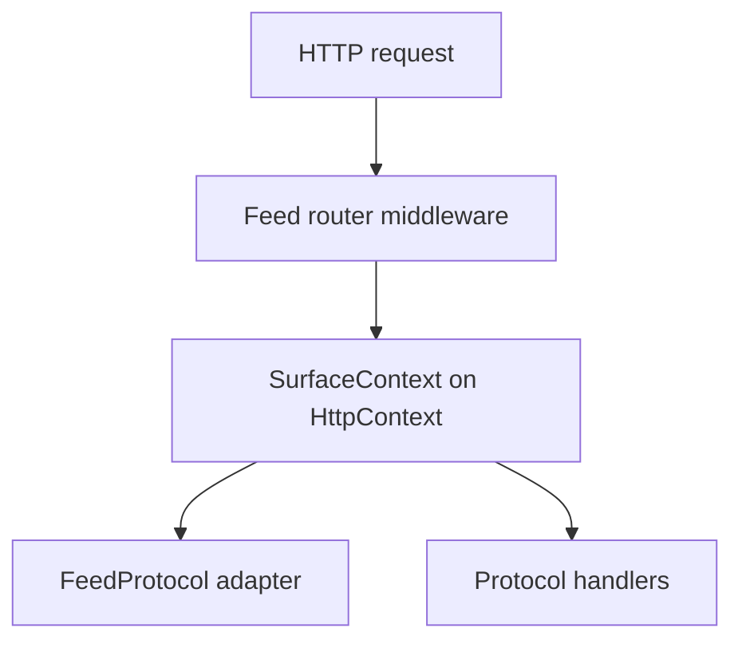
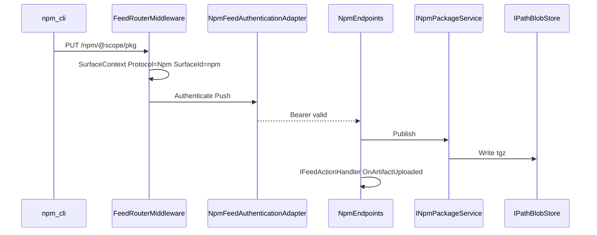

# npm Multi-Feed Platform Plan

Parent epic: [GitHub #557](https://github.com/AvantiPoint/avantipoint.packages/issues/557). Design reference: [MULTI-FEED-PLATFORM-SPEC.md](MULTI-FEED-PLATFORM-SPEC.md).

**Prerequisite:** [Phase 0 #558](https://github.com/AvantiPoint/avantipoint.packages/issues/558) (Feed.Platform extraction). **npm delivery:** [Phase 2 #561](https://github.com/AvantiPoint/avantipoint.packages/issues/561).

---

## Problem statement

Today auth and lifecycle hooks are NuGet-only:

- [`IPackageAuthenticationService`](src/AvantiPoint.Packages.Core/Authentication/IPackageAuthenticationService.cs) + [`NuGetAuthenticationResult`](src/AvantiPoint.Packages.Core/Authentication/NuGetAuthenticationResult.cs)
- [`AuthorizedNuGetFilter`](src/AvantiPoint.Packages.Hosting/Authentication/AuthorizedNuGetFilter.cs) (`X-NuGet-ApiKey`, Basic)
- [`INuGetFeedActionHandler`](src/AvantiPoint.Packages.Hosting/INuGetFeedActionHandler.cs) + [`PackageActionAttributeBase`](src/AvantiPoint.Packages.Hosting/Internals/PackageActionAttributeBase.cs)

npm needs Bearer tokens and packument/tarball events. OCI needs **multiple registrations** (default `/v2/`, named `/docker/v2/`, `/helm/v2/`) with distinct policy and storage prefixes. A single `Oci` enum value is insufficient for “which registry instance.”

---

## Identity model: protocol + surface instance



| Field | Type | Role |
|-------|------|------|
| `FeedProtocol` | enum | Client ecosystem: `NuGet`, `Oci`, `Npm` — picks auth adapter, HTTP pipeline, coarse metrics |
| `SurfaceId` | string | Stable registration id from code (`nuget`, `npm`, `oci-default`, `oci-docker`) — policy binding, callbacks, logs |
| `OciSegment` | string? | URL segment for named OCI only (`null` = default `/v2/`; `docker` = `/docker/v2/`) |
| `RoutePrefix` | string | `""`, `/npm`, `/docker` |
| `FeedId` | string | Logical feed scope (storage/DB) |
| `PublicBaseUrl` | Uri | Request-derived origin + prefix (no `publicUrl` in config) |

**Registration (code, not JSON `enabled` flags):**

```csharp
var feed = builder.AddAvantiPointFeed(configuration.GetSection("Feed"));
feed.UseNuGet(surfaceId: "nuget");
feed.UseNpm(routePrefix: "/npm", surfaceId: "npm");
feed.UseOciDefault(surfaceId: "oci-default");
feed.UseOci("docker", surfaceId: "oci-docker", o => o.Bind(configuration.GetSection("Feed:Oci:Docker")));
feed.UseOci("helm", surfaceId: "oci-helm", o => o.Bind(configuration.GetSection("Feed:Oci:Helm")));
```

**Route resolution** (from spec §5.0.9 — unchanged):

1. `/v3/`, `/api/`, `/shield/` → NuGet surface
2. `/v2/` → default OCI surface (if registered)
3. `/{segment}/v2/` → named OCI surface matching `OciSegment`
4. `/npm/` → npm surface
5. else 404

Router output: full `SurfaceContext` on [`ISurfaceContextAccessor`](src/) (new, in Feed.Platform).

**Metrics/logs:** always emit `feed_protocol`, `surface_id`, and `oci_segment` (when set) — not protocol alone.

---

## Phase 0 — Feed.Platform (#558)

New project: `src/AvantiPoint.Feed.Platform/`

### Core types

```csharp
public enum FeedProtocol { NuGet, Oci, Npm }

public sealed record SurfaceContext(
    string FeedId,
    FeedProtocol Protocol,
    string SurfaceId,
    string? OciSegment,
    string RoutePrefix,
    Uri PublicBaseUrl);

public sealed record SurfaceRegistration(
    string SurfaceId,
    FeedProtocol Protocol,
    string? OciSegment,
    string RoutePrefix,
    string OptionsSectionKey); // e.g. Feed:Oci:Docker
```

- **`IFeedRegistry`** — tracks code-registered surfaces; validates no route/segment collisions (`v3`, `api`, `shield`, `npm`, reserved segments).
- **`FeedRouterMiddleware`** — match path → set `SurfaceContext`; strip `/{segment}` for named OCI before shared handlers (OCI phase).
- **`IPublicBaseUrlProvider`** — derive from `HttpContext` (scheme, host, `PathBase`, forwarded headers).
- **`FeedContext`** — deployment-wide: `FeedId`, name, storage prefix, shared `Feed:Authentication` options.

### Storage (foundation)

- **`IPathBlobStore`** — path keys for NuGet + npm; wraps existing [`IStorageService`](src/AvantiPoint.Packages.Core/Storage/) in Core.
- **`IDigestBlobStore`** — interface only in Phase 0; OCI implementation in #559.
- **`IStorageBackendFactory`** — per-feed prefix: `packages/`, `npm/`, `oci/`, `oci/{segment}/`.

### Database (Phase 0 scope)

- Platform tables: `Feeds`, `FeedApiKeys` (conceptual names per spec).
- Add **`FeedId`** to NuGet [`Package`](src/AvantiPoint.Packages.Core/Entities/Package.cs) + migrations in all `AvantiPoint.Packages.Database.*` projects (default feed for existing rows).
- Map absent `Feed` config → existing [`PackageFeedOptions`](src/AvantiPoint.Packages.Core/Configuration/PackageFeedOptions.cs); host calls `UseNuGet()` only.

### NuGet integration (no client break)

- Wrap [`MapNuGetApiRoutes`](src/AvantiPoint.Packages.Hosting/PackagesApi.cs) behind `feed.UseNuGet()`; router dispatches NuGet paths only when registered.
- [`IUrlGenerator`](src/) → feed-scoped `NuGetFeedUrlGenerator` using `SurfaceContext.PublicBaseUrl`.
- All existing NuGet integration tests must pass unchanged.

### Authentication (platform contract)

```csharp
public interface IFeedAuthenticationService
{
    Task<FeedAuthenticationResult> AuthenticateAsync(
        FeedAuthenticationRequest request,
        CancellationToken cancellationToken);
}

public sealed record FeedAuthenticationRequest(
    SurfaceContext Surface,
    HttpContext HttpContext,
    FeedOperation Operation); // Pull, Push, Login

public sealed record FeedAuthenticationResult(
    bool Succeeded,
    ClaimsPrincipal? User,
    string? Message,
    IReadOnlyDictionary<string, string>? ResponseHeaders);
```

**Adapters** (Feed.Platform or per-protocol packages):

| Adapter | When | Credential extraction |
|---------|------|------------------------|
| `NuGetFeedAuthenticationAdapter` | `Protocol == NuGet` | Existing `X-NuGet-ApiKey`, Basic → delegate to [`ApiKeyAuthenticationService`](src/AvantiPoint.Packages.Core/Authentication/ApiKeyAuthenticationService.cs) |
| `NpmFeedAuthenticationAdapter` | `Protocol == Npm` | `Authorization: Bearer` (API key as token for MVP) |
| `OciFeedAuthenticationAdapter` | `Protocol == Oci` | Distribution Bearer/Basic; branch policy on `SurfaceId` / `OciSegment` (#559) |

**NuGet migration:** keep `IPackageAuthenticationService` as facade over `IFeedAuthenticationService` with `SurfaceId = "nuget"` until filters migrate to `FeedAuthenticationResult`. [`AuthorizedNuGetFilter`](src/AvantiPoint.Packages.Hosting/Authentication/AuthorizedNuGetFilter.cs) unchanged behavior via adapter mapping headers.

Policy evaluation uses **full `SurfaceContext`** — e.g. `Feed:Oci:Docker` platform policy applies only when `SurfaceId == "oci-docker"`.

### Callbacks (feed-type-aware lifecycle)

```csharp
public interface IFeedActionHandler
{
    Task<bool> CanAccessArtifact(FeedArtifactEventContext context, CancellationToken cancellationToken);
    Task OnArtifactDownloaded(FeedArtifactEventContext context, CancellationToken cancellationToken);
    Task OnArtifactUploaded(FeedArtifactEventContext context, CancellationToken cancellationToken);
}

public sealed record FeedArtifactEventContext(
    SurfaceContext Surface,
    string ArtifactName,
    string? Version,
    string? DigestOrTarballPath);
```

- **`INuGetFeedActionHandler`** — keep; add adapter implementing `IFeedActionHandler` mapping packageId/version.
- npm/OCI handlers fire with correct `Surface` (including `oci-docker` vs `oci-helm`).
- Optional: `IFeedActionHandler` keyed by `SurfaceId` for host apps that only care about one surface.

Replace [`PackageActionAttributeBase`](src/AvantiPoint.Packages.Hosting/Internals/PackageActionAttributeBase.cs) gradually to read `ISurfaceContextAccessor` + dispatch `IFeedActionHandler`.

### Phase 0 exit criteria

- NuGet-only host: `UseNuGet()` only; OCI/npm routes 404.
- `SurfaceContext` populated on every routed request.
- `IFeedAuthenticationService` + NuGet facade wired; existing auth tests pass.
- `FeedId` migration applied.

---

## Phase 2 — npm registry (#561)

New project: `src/AvantiPoint.Packages.Registry.Npm/`

**Isolation rule:** no `Package` entity, no [`PackageIndexingService`](src/AvantiPoint.Packages.Core/Indexing/), no NuGet search indexer.

### Data model

| Entity | Key fields |
|--------|------------|
| `NpmPackage` | `FeedId`, `Name` (scoped/unscoped) |
| `NpmVersion` | `FeedId`, `PackageId`, `Version`, `TarballDigest`, `Shasum`, `Origin`, packument JSON |
| `NpmDistTag` | `FeedId`, `PackageId`, `Tag`, `Version` |

Reuse shared **`ArtifactOrigin`** (align with [`PackageOrigin`](src/AvantiPoint.Packages.Core/Entities/Package.cs): `Published`, `Mirrored`, `Cached`) for Phase 3 discovery filters — mirror implementation deferred to #562.

Migrations in each database provider project (same pattern as recent `PackageOrigin` migrations).

### Storage

Via `IPathBlobStore`:

```text
{feedPrefix}npm/{encodedPackage}/-/{name}-{version}.tgz
```

### Services

- `INpmPackageService` — publish, get packument, resolve dist-tag, stream tarball.
- `NpmOptions` bound from `Feed:Npm` when `UseNpm()` registered.

### HTTP API (MVP per #561)

| Method | Path |
|--------|------|
| GET | `/{package}` — packument |
| GET | `/{package}/-/{tarball}` |
| PUT | `/{package}` — publish |
| GET | `/-/whoami` |
| GET | `/-/v1/search` — empty array initially |
| PUT | `/-/user/*` — stub or minimal; full login deferred |

- Scoped packages: URL-encoded `@scope/name`.
- Dist-tags: `latest` + custom in packument.
- Endpoint filters: `AuthorizedNpmPublisherFilter` / `AuthorizedNpmConsumerFilter` using `NpmFeedAuthenticationAdapter` + `SurfaceContext` (`SurfaceId = "npm"`).

### Host wiring

```csharp
feed.UseNpm(routePrefix: "/npm", surfaceId: "npm");
```

Maps `MapGroup` under `/npm`; registers surface in `IFeedRegistry`; binds `configuration.GetSection("Feed:Npm")`.

Update sample host ([`samples/IntegrationTestApi/Program.cs`](samples/IntegrationTestApi/Program.cs)) and docs when npm ships.

### Out of scope (#561)

- npm upstream mirror/cache (#562)
- npm provenance / Sigstore
- Cross-feed unified search

---

## Request flow (npm)



---

## Testing strategy

New test project: `tests/AvantiPoint.Packages.Registry.Npm.Tests` (or extend integration tests).

| Test | Approach |
|------|----------|
| Packument shape | JSON snapshot tests |
| Publish/install | `npm` CLI against test host; `NPM_TOKEN` = configured API key |
| Auth | 401 without Bearer; `/-/whoami` 200 with token |
| Multi-surface | Same host: `v3/index.json` + npm routes; assert `SurfaceContext` on npm requests |
| No npmjs in CI | Local feed only; optional Verdaccio container for parity |

Use existing [`DockerFact`](tests/AvantiPoint.Packages.Integration.Tests/TestInfrastructure/) pattern where containers are needed.

Phase 0 adds router tests: NuGet paths resolve `SurfaceId=nuget`; unregistered `/npm` → 404 until `UseNpm()`.

---

## Suggested GitHub sub-issues

Under **#558 (Phase 0):**

- Platform: `FeedProtocol`, `SurfaceContext`, `SurfaceRegistration`, `IFeedRegistry`
- Platform: `FeedRouterMiddleware` + `ISurfaceContextAccessor`
- Platform: `IFeedAuthenticationService` + NuGet adapter/facade
- Platform: `IFeedActionHandler` + NuGet adapter
- Platform: `IPathBlobStore` / `IStorageBackendFactory` + `FeedId` migrations
- NuGet: `UseNuGet()` + feed-scoped URL generator; existing tests green

Under **#561 (Phase 2 npm):**

- Registry.Npm: entities + migrations + `INpmPackageService`
- Registry.Npm: blob layout via `IPathBlobStore`
- Registry.Npm: HTTP endpoints + npm auth filters
- Registry.Npm: dist-tags + scoped packages
- Tests: snapshots + npm CLI round-trip
- Docs/sample: `UseNpm()` + `Feed:Npm` appsettings

---

## Success criteria

- **Identity:** Auth, callbacks, logs, and policy can target `SurfaceId=oci-docker` vs `oci-helm` while sharing `FeedProtocol.Oci`.
- **npm (#561):** `npm publish` / `npm install` against `{origin}/npm/` in CI without npmjs credentials.
- **Compatibility:** NuGet v4 routes at host root unchanged; unregistered surfaces return 404.
- **Phase 0 (#558):** All existing NuGet tests pass; platform ready for OCI (#559) in parallel with npm.
